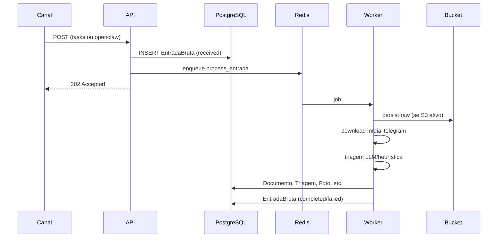

# Arquitetura — Obrabot

Visão técnica dos componentes, fluxos de dados e estados do sistema.

## Componentes

```
┌──────────────┐     ┌──────────────┐     ┌──────────────┐
│   Cliente    │     │   OpenClaw   │     │ Painel Admin │
│  HTTP /tasks │     │   Telegram   │     │   /admin     │
└──────┬───────┘     └──────┬───────┘     └──────┬───────┘
       │                    │ HMAC               │ sessão
       └────────────────────┼────────────────────┘
                            ▼
                   ┌─────────────────┐
                   │   API FastAPI   │
                   │  (serviço api)  │
                   └────────┬────────┘
                            │
              ┌─────────────┼─────────────┐
              ▼             ▼             ▼
        ┌──────────┐  ┌──────────┐  ┌──────────┐
        │ Postgres │  │  Redis   │  │ S3/MEGA  │
        └──────────┘  └────┬─────┘  └──────────┘
                             │
                             ▼
                   ┌─────────────────┐
                   │  Worker RQ      │
                   │ (serviço worker)│
                   └─────────────────┘
```

| Componente | Responsabilidade |
|------------|------------------|
| **API** | HTTP, auth, enfileiramento, rotas síncronas de documentos |
| **Worker** | `process_entrada`: storage, mídia, triagem, domínio |
| **PostgreSQL** | Entidades, relações, status, auditoria |
| **Redis** | Fila RQ `obrabot`, rate limit, idempotência auxiliar |
| **S3** | Envelopes brutos, mídias, rascunhos, PDFs finais |
| **OpenClaw** | Gateway Telegram; chama API com HMAC (sem acesso direto a DB/S3) |

## Ingestão unificada

Todo canal converge em `EntradaBruta`:



### Resolução de obra (Telegram)

Ordem de precedência:

1. `obra_id` no payload OpenClaw
2. Prefixo no texto/caption (`OBRA-001: ...`)
3. `telegram_contextos` (chat + thread)
4. `pending_obra` se nada resolver

## Pipeline do worker (`run_entrada_pipeline`)

1. Persistir envelope bruto no bucket (`01_entrada_bruta/`)
2. Baixar mídias Telegram (`photo`, `voice`, `audio`, `document`)
3. `media_service.ingest_media`: `Arquivo` + `Foto`/`AudioTranscricao`
4. Compor texto para triagem (texto + descrições de mídia)
5. `openai_service.triagem_structured` → `TriagemOutput`
6. Criar `Documento` (status `TRIADO`) + `Triagem` + auditoria
7. Opcional: reply Telegram com hints de comandos (`telegram_reply_enabled`)

## Ciclo de vida do documento

```
RECEBIDO → TRIADO → RASCUNHO_GERADO → EM_REVISAO → APROVADO → FINALIZADO_VALIDADO
                              ↘ REPROVADO ↗
```

Publicação final no bucket (`04_documentos_finais/`, `05_RDO/finalizados_pdf/`) só após aprovação humana registrada em `aprovacoes`.

## Fluxo RDO

1. **Evidências do dia**: entradas com `data_ref` + fotos/áudios associados
2. **Agregação**: `rdo_aggregator_service.aggregate_daily_rdo` monta JSON estruturado (inclui `baseline` se validado)
3. **Rascunho**: `rdo_service.create_rdo_draft` → HTML em `05_RDO/rascunhos/`
4. **Complementos**: admin edita clima, equipe, etc. → regenera HTML
5. **Aprovação + PDF**: `approve_and_finalize_rdo` → PDF em `05_RDO/finalizados_pdf/`

## Fluxo relatório fotográfico

1. Fotos em `fotos` (classificadas pelo worker com `describe_image`)
2. `foto_service.generate_photo_report` filtra por período → rascunho HTML
3. `approve_and_finalize_photo_report` re-renderiza com imagens base64 → PDF final

## Fluxo baseline (orçamento + cronograma)

1. Importar itens (`orcamento_itens`) e atividades (`cronograma_atividades`)
2. `validate_baseline` verifica completude e inconsistências
3. `approve_baseline` grava snapshot JSON em `07_planejamento/baseline/` e marca `obra.metadata_json.baseline`

Atividades podem referenciar itens de orçamento via `codigo_orcamento` no metadata.

## Camadas de código

```
src/api/routes/     → HTTP (thin controllers)
src/services/       → regras de negócio
src/db/models.py    → persistência
src/schemas/        → contratos Pydantic (API)
src/templates/      → HTML para PDF
src/worker/         → jobs RQ
openclaw/           → orquestração conversacional
```

## Segurança (produção)

| Controle | Implementação |
|----------|----------------|
| API key | `X-Obrabot-API-Key` em rotas protegidas |
| OpenClaw | HMAC-SHA256 + timestamp ±5min + `event_id` |
| Telegram | Allowlist chat/user/thread |
| Rate limit | Redis por user/chat |
| Admin | Sessão assinada, rate limit login, CSRF Origin/Referer |
| Fail-closed | Sem secrets admin → API não sobe em prod |

## Testes e validação

| Script | Valida |
|--------|--------|
| `scripts/smoke_prod.py` | Health, API key, OpenClaw |
| `scripts/smoke_rdo.py` | RDO gerar + aprovar PDF |
| `scripts/smoke_foto.py` | Relatório fotográfico E2E |
| `scripts/smoke_orcamento.py` | Orçamento + cronograma + baseline |

Ver também [operations.md](operations.md) e [api-reference.md](api-reference.md).
